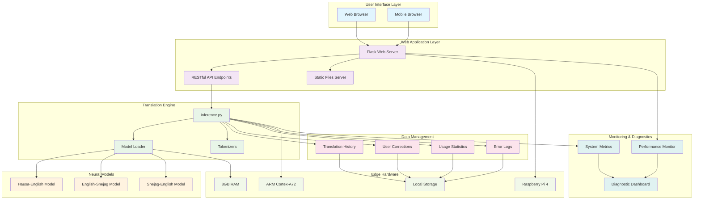
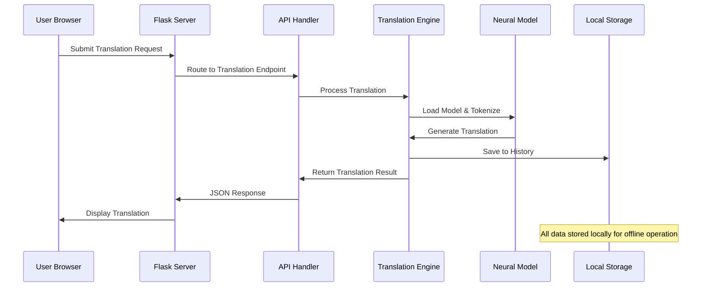
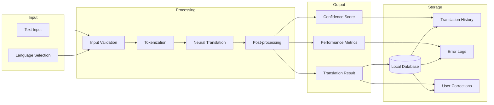
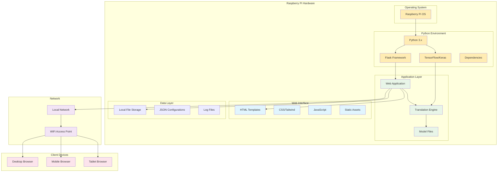

# Web-Based Neural Machine Translation System Architecture

## System Architecture Diagram

```mermaid
graph TB
    subgraph "User Interface Layer"
        UI[Web Browser]
        Mobile[Mobile Browser]
    end
    
    subgraph "Web Application Layer"
        Flask[Flask Web Server]
        API[RESTful API Endpoints]
        Static[Static Files Server]
    end
    
    subgraph "Translation Engine"
        Inference[inference.py]
        ModelLoader[Model Loader]
        Tokenizer[Tokenizers]
    end
    
    subgraph "Neural Models"
        HausaEN[Hausa-English Model]
        ENSnejag[English-Snejag Model]
        SnejagEN[Snejag-English Model]
    end
    
    subgraph "Data Management"
        History[Translation History]
        Corrections[User Corrections]
        Stats[Usage Statistics]
        Errors[Error Logs]
    end
    
    subgraph "Edge Hardware"
        RPi[Raspberry Pi 4]
        CPU[ARM Cortex-A72]
        Memory[8GB RAM]
        Storage[Local Storage]
    end
    
    subgraph "Monitoring & Diagnostics"
        PerfMon[Performance Monitor]
        Diagnostics[Diagnostic Dashboard]
        Metrics[System Metrics]
    end
    
    %% User interactions
    UI --> Flask
    Mobile --> Flask
    
    %% Flask routing
    Flask --> API
    Flask --> Static
    
    %% API to Translation Engine
    API --> Inference
    
    %% Translation Engine components
    Inference --> ModelLoader
    Inference --> Tokenizer
    ModelLoader --> HausaEN
    ModelLoader --> ENSnejag
    ModelLoader --> SnejagEN
    
    %% Data flows
    Inference --> History
    Inference --> Corrections
    Inference --> Stats
    Inference --> Errors
    
    %% Hardware deployment
    Flask --> RPi
    Inference --> CPU
    ModelLoader --> Memory
    History --> Storage
    Corrections --> Storage
    Stats --> Storage
    Errors --> Storage
    
    %% Monitoring
    Flask --> PerfMon
    Inference --> Metrics
    PerfMon --> Diagnostics
    Metrics --> Diagnostics
    
    %% Styling
    classDef userLayer fill:#e1f5fe
    classDef webLayer fill:#f3e5f5
    classDef engineLayer fill:#e8f5e8
    classDef modelLayer fill:#fff3e0
    classDef dataLayer fill:#fce4ec
    classDef hardwareLayer fill:#f1f8e9
    classDef monitorLayer fill:#e0f2f1
    
    class UI,Mobile userLayer
    class Flask,API,Static webLayer
    class Inference,ModelLoader,Tokenizer engineLayer
    class HausaEN,ENSnejag,SnejagEN modelLayer
    class History,Corrections,Stats,Errors dataLayer
    class RPi,CPU,Memory,Storage hardwareLayer
    class PerfMon,Diagnostics,Metrics monitorLayer
```

## Component Flow Diagram

```mermaid
sequenceDiagram
    participant User as User Browser
    participant Flask as Flask Server
    participant API as API Handler
    participant Inference as Translation Engine
    participant Model as Neural Model
    participant Storage as Local Storage
    
    User->>Flask: Submit Translation Request
    Flask->>API: Route to Translation Endpoint
    API->>Inference: Process Translation
    Inference->>Model: Load Model & Tokenize
    Model->>Inference: Generate Translation
    Inference->>Storage: Save to History
    Inference->>API: Return Translation Result
    API->>Flask: JSON Response
    Flask->>User: Display Translation
    
    Note over Storage: All data stored locally for offline operation
```

## Data Flow Architecture

```mermaid
flowchart LR
    subgraph Input
        TextInput[Text Input]
        LangSelect[Language Selection]
    end
    
    subgraph Processing
        Validate[Input Validation]
        Tokenize[Tokenization]
        Translate[Neural Translation]
        PostProcess[Post-processing]
    end
    
    subgraph Output
        TransResult[Translation Result]
        Confidence[Confidence Score]
        Metrics[Performance Metrics]
    end
    
    subgraph Storage
        LocalDB[(Local Database)]
        HistoryLog[Translation History]
        ErrorLog[Error Logs]
        UserCorrections[User Corrections]
    end
    
    TextInput --> Validate
    LangSelect --> Validate
    Validate --> Tokenize
    Tokenize --> Translate
    Translate --> PostProcess
    PostProcess --> TransResult
    PostProcess --> Confidence
    PostProcess --> Metrics
    
    TransResult --> LocalDB
    Confidence --> HistoryLog
    Metrics --> ErrorLog
    TransResult --> UserCorrections
    
    LocalDB --> HistoryLog
    LocalDB --> ErrorLog
    LocalDB --> UserCorrections
```

## System Deployment Architecture

```mermaid
graph TB
    subgraph "Raspberry Pi Hardware"
        subgraph "Operating System"
            OS[Raspberry Pi OS]
        end
        
        subgraph "Python Environment"
            Python[Python 3.x]
            Flask[Flask Framework]
            TensorFlow[TensorFlow/Keras]
            Dependencies[Dependencies]
        end
        
        subgraph "Application Layer"
            WebApp[Web Application]
            TransEngine[Translation Engine]
            ModelFiles[Model Files]
        end
        
        subgraph "Web Interface"
            HTML[HTML Templates]
            CSS[CSS/Tailwind]
            JS[JavaScript]
            Assets[Static Assets]
        end
        
        subgraph "Data Layer"
            LocalFiles[Local File Storage]
            JSON[JSON Configurations]
            Logs[Log Files]
        end
    end
    
    subgraph "Network"
        LocalNet[Local Network]
        WiFi[WiFi Access Point]
    end
    
    subgraph "Client Devices"
        Desktop[Desktop Browser]
        Mobile[Mobile Browser]
        Tablet[Tablet Browser]
    end
    
    %% Connections
    OS --> Python
    Python --> Flask
    Python --> TensorFlow
    Flask --> WebApp
    TensorFlow --> TransEngine
    WebApp --> HTML
    WebApp --> TransEngine
    TransEngine --> ModelFiles
    WebApp --> LocalFiles
    
    WebApp --> LocalNet
    LocalNet --> WiFi
    WiFi --> Desktop
    WiFi --> Mobile
    WiFi --> Tablet
    
    %% Styling
    classDef hardware fill:#ffecb3
    classDef software fill:#e8f5e8
    classDef web fill:#e1f5fe
    classDef network fill:#f3e5f5
    classDef client fill:#fce4ec
    
    class OS,Python,Flask,TensorFlow,Dependencies hardware
    class WebApp,TransEngine,ModelFiles software
    class HTML,CSS,JS,Assets web
    class LocalNet,WiFi network
    class Desktop,Mobile,Tablet client
```
