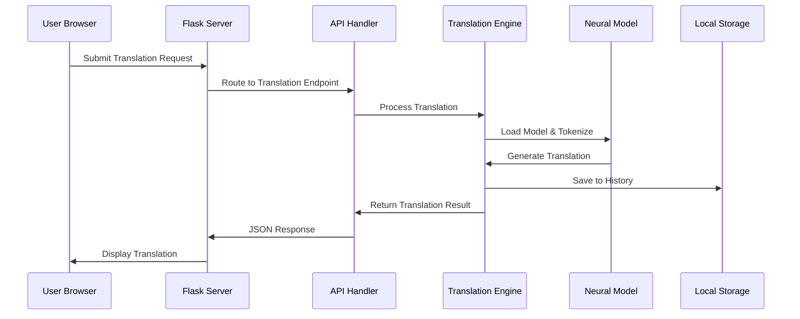

```mermaid
sequenceDiagram
    participant User as User Browser
    participant Flask as Flask Server
    participant API as API Handler
    participant Inference as Translation Engine
    participant Model as Neural Model
    participant Storage as Local Storage
    
    User->>Flask: Submit Translation Request
    Flask->>API: Route to Translation Endpoint
    API->>Inference: Process Translation
    Inference->>Model: Load Model & Tokenize
    Model->>Inference: Generate Translation
    Inference->>Storage: Save to History
    Inference->>API: Return Translation Result
    API->>Flask: JSON Response
    Flask->>User: Display Translation

```

